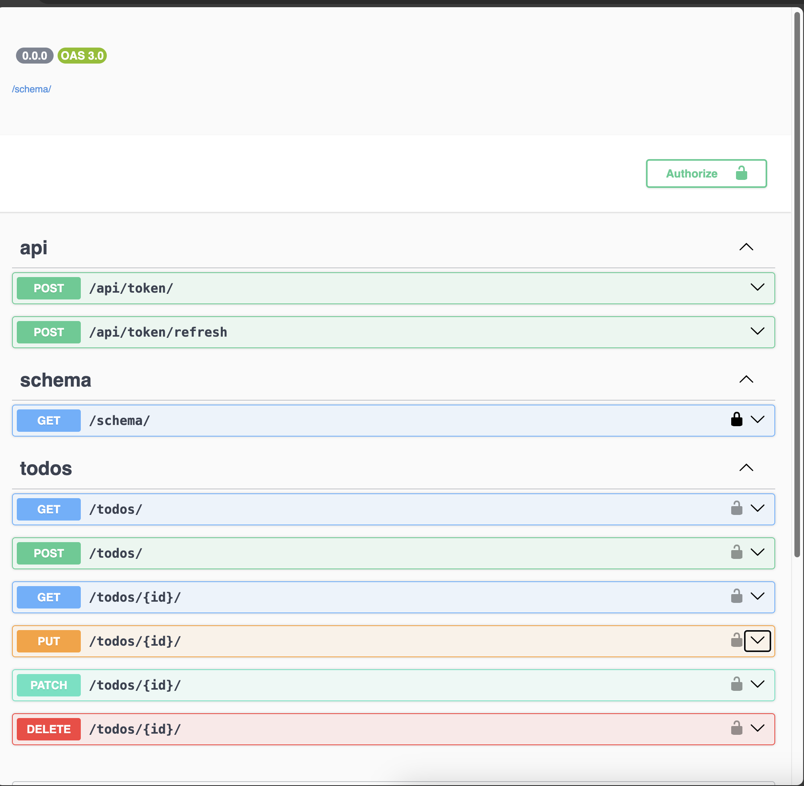

# Django Todo Application

## Description

This is a web application built with Django, Django REST Framework, and SQLite. It provides a platform for users to manage their todo items, helping them keep track of tasks, and mark tasks as completed. The application showcases the use of Django REST Framework for building APIs and uses JWT (JSON Web Tokens) for secure authentication. It also uses `drf_spectacular` for Swagger documentation of the API.

## Installation

1. Clone the repository
```bash
git clone <repository-url>
```

2. Navigate to the project directory
```
cd todo_project
```

3. Install the required dependencies

```
pip install -r requirements.txt
```
4. Run the server

```
python manage.py runserver
```


## Features

- Create, update, and delete todo items
- Mark tasks as completed
- RESTful API endpoints
- JWT Authentication with `rest_framework_simplejwt`
- Swagger documentation with `drf_spectacular`

## Swagger UI



## Technologies Used

- Django: A high-level Python Web framework that encourages rapid development and clean, pragmatic design.
- Django REST Framework: A powerful and flexible toolkit for building Web APIs.
- SQLite: A C library that provides a lightweight disk-based database.
- JWT: JSON Web Tokens are used for secure transmission of information between parties as a JSON object.
- drf_spectacular: A Django REST Framework extension for beautiful and customizable Swagger UI.

## Contributing

Pull requests are welcome. For major changes, please open an issue first to discuss what you would like to change.

## License

[MIT](https://choosealicense.com/licenses/mit/)